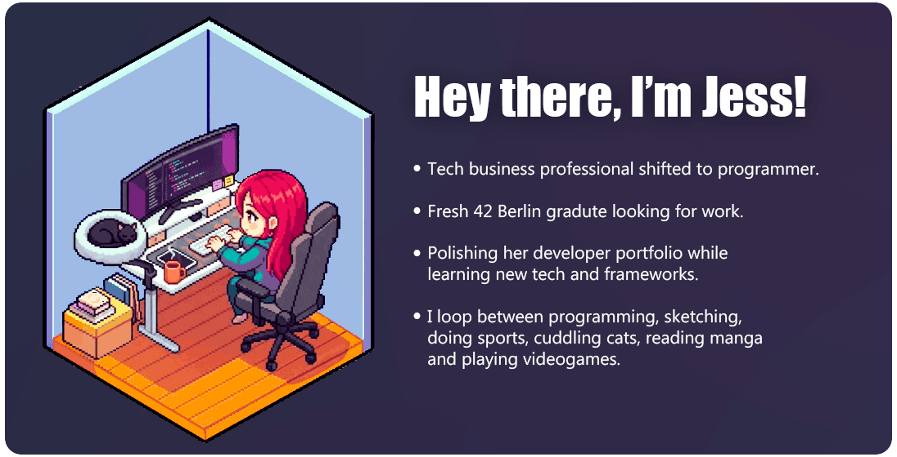
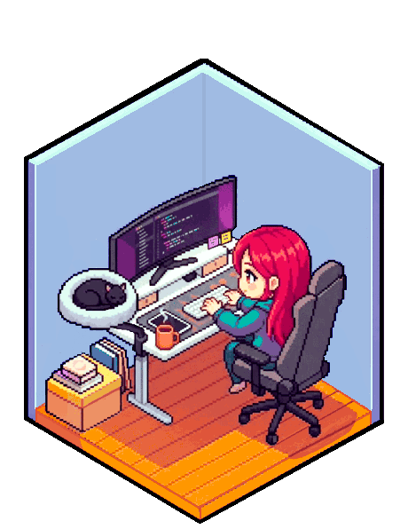

<!------------------------------------------------ Intro Card ------------------------------------------------>
<!-- 

  

  
-->

<!------------------------------------ About and Experience ----------------------------->
  

<h3 align="center">👋 Hey there, I'm Jess!</h3>  

 

I am a `Software Engineer` with a background in `B2B consulting and technical operations` in the mobile apps and games industry.
My experience across established enterprise software companies often required my direct involvement in `stakeholder communication` and `product strategy`, gaining unique skills in `problem-solving`, `analytical thinking` and `cross-team collaboration`.
 

I'm a naturally curious person who's always been driven by the `'what-if'` and `'why-not'` while focusing on the `how` and `why` of things, which is a mindset I naturally carry over to both my work and personal life.

I have a passion for building `full-stack` applications across web and mobile. I prioritize `modular architecture`, `abstract design`, and `iterative testing` to turn complex problems into clean, scalable, and highly maintainable code.

 I also have a special interest in `game programming`, in which I apply my recent game development experience I acquired at <a href="https://www.linkedin.com/company/ubisoft/"> Ubisoft</a> and combine it with my industry expertise from my past work at <a href="https://www.linkedin.com/company/unity/"> Unity</a>, <a href="https://www.linkedin.com/company/gameanalytics/"> GameAnalytics</a>, <a href="https://www.linkedin.com/company/playtestcloud/"> PlaytestCloud</a> and <a href="https://www.linkedin.com/company/sensor-tower/"> Sensor Tower</a>.

 

 <!----------------- Contacts ----------------->

  
  
  
<!----------------- ViewCount ----------------->
  

 

<!------------------------ Featured Projects ------------------------>
<h1 align="center">Featured projects</h1>  
<!-- # Featured projects -->

<!-- Project 1 -->
   
<!-- Project2 -->
  
<!-- Project3 -->
   
<!-- Project4 -->
    
<!-- Project5 -->
   
<!-- Project 6-->

<!-- Project 7-->
  <!--  -->
<!-- Project 8-->
    <!--  -->

 

<!--------------------- Tech Stack --------------------->
<h1 align="center">Tech Stack</h1>  

**Programming Languages**  

  

**Frontend Development**  

**Mobile Development**  

**Backend Development, Databases and Cloud Hsting**  

**Game Development**  

**DevOps & Tools**  

**Agentic / Ai Tooling**  

 

 <!------------------------------------------------ Badges & Widgets ------------------------------------------------>
<!-- <h3 align="center">Badges and widgets</h3>  -->

# Badges and widgets

<!-- --- -->
